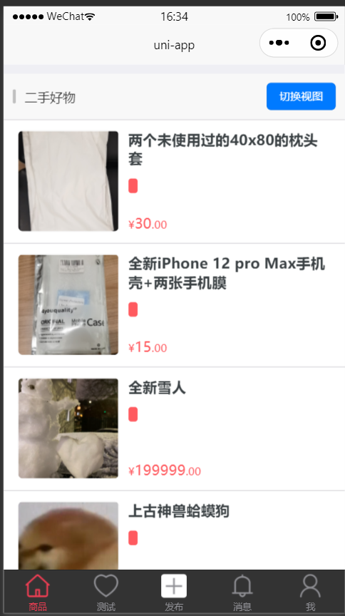
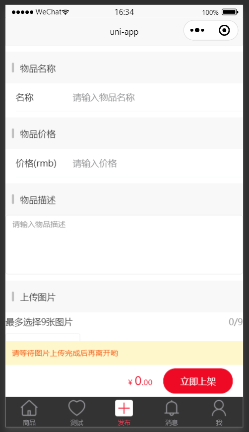

# 基于vue2的二手交易平台/Second-hands trading platform based on vue2

## 上线/Publish：

### Configure cloud space:
Go to https://unicloud.dcloud.net.cn/ buy aliCloud or tencentCloud. Open with HBuilderX, Right click uniCloud folder-关联云服务空间或项目, choose the cloud provider you use. If you already have db_init.json, substitute it with uniCloud-database-db_init.json, then right click it-初始化云数据库.

### Configure WeChat white list:
Since WeChat may limit API for serverless function, we may need to configure API white list. Go to https://mp.weixin.qq.com/wxamp/home/guide, 开发-开发管理-开发设置-服务器域名, they follow https://uniapp.dcloud.net.cn/uniCloud/publish.html#useinmp to add coresponding URL.

#### 上线为微信小程序/Publish as WeChat miniprogram：
在项目根目录中的manifest.json中配置微信小程序AppID。点击发行-小程序微信后会自动打开微信开发者工具，然后上传。也可以勾选自动上传到微信平台，然后去小程序后台下载私钥.key文件，添加后即可完成自动上传。上传成功后前往小程序后台提交审核。
#### 打包成安卓app/Publish as Android app：
发行--原生app-云打包

## 页面展示/Page presentation：
商品页面/Goods tab：

发布页面/Publish tab:

